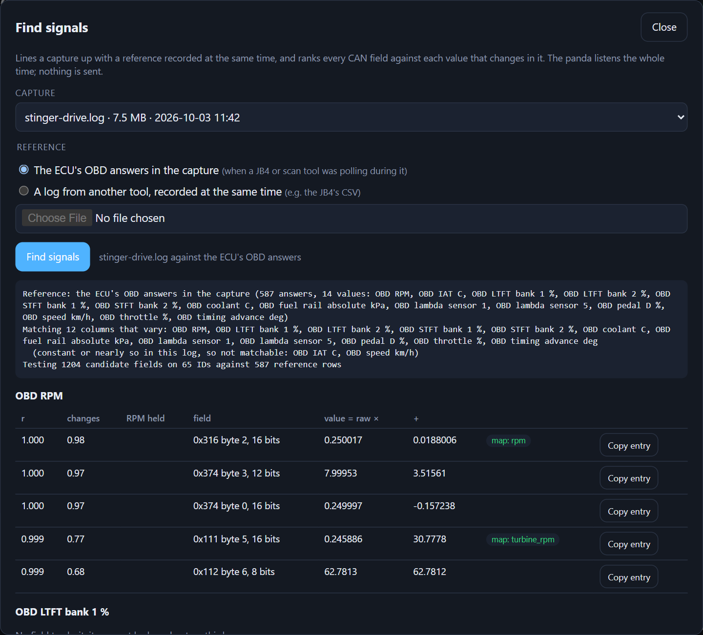

# PandaCapture for comma pandas

Records a car's CAN buses through a [comma](https://comma.ai) Red Panda or Black Panda, and shows
them live as gauges, numbers and status lights.


- **Captures** are candump logs, for finding the signals a FrostBYTE water/methanol controller
  should read (RPM, MAP/boost, intake temperature). The FrostBYTE Android app's signal finder,
  SavvyCAN and can-utils all read them.
- **The live dashboard** decodes the traffic in your browser with an address map for your vehicle.
  A Kia Stinger 3.3T map is built in.
- **The panda's firmware:** PandaCapture flashes its own onto the panda, backing up what was there
  first.
- **Transmitting:** it can send frames once you acknowledge a warning.

- **Listen-only by default.** The panda's CAN controllers sit in bus-monitoring mode: no ACKs, no
  error frames, nothing transmitted. The bus can't tell the panda is there.
- **Bit rates are found automatically**, by listening at each rate. A wrong rate can't disturb
  the bus while the panda is silent.
- **All three buses at once.** The log names them `can0`, `can1` and `can2`, and the status line
  shows which ones carry traffic. The Red Panda also receives CAN FD; the Black Panda is classic
  CAN only.
- **Windows and Linux** now. macOS and the FrostBYTE Android app over USB OTG are planned; see
  [docs/protocol.md](docs/protocol.md).
- **Transmitting is gated.** You type `TRANSMIT` after a warning. Only PandaCapture's firmware can
  transmit at all, and it stops by itself within about 2 seconds if this program goes away.
- **Other adapters too (Windows):** RP1210 and J2534 tools such as a NEXIQ USB-Link 2, a Tactrix
  OpenPort or a Mongoose can record and drive the dashboard instead of a panda. See
  [Other adapters](#other-adapters-rp1210-and-j2534).
- **One file, nothing to install.** The program carries the firmware for both panda families, the
  dashboard and the built-in maps.

> **Status:** tested on a oneclone mini blackpanda (STM32F4):
> - flash backup, flashing and updating, and the transmit gate
> - capture from a Kia Stinger's P-CAN: about 2,430 frames/s for 165 s, with no dropouts
> - the dashboard: replaying real Stinger captures at full rate, with all 76 map signals decoding
>
> Not yet tested: a Red Panda, transmitting on a real bus, and the dashboard live in the car.
> See [STATUS.md](STATUS.md).

## Hardware

| Panda | Capture | PandaCapture firmware, transmit |
|---|---|---|
| Red Panda (STM32H7) | yes | yes |
| Black Panda (STM32F4) | yes | yes: built from comma's last panda firmware with every F4 board |
| Grey Panda (STM32F4), and boards that detect as one, such as oneclone's mini blackpanda | yes (tested on a oneclone board) | yes, same F4 build (flashed and gate-tested on a oneclone board) |
| White Panda (STM32F4) | yes | the F4 build supports it; untried, needs `flash --force` |
| Panda inside a comma three / 3X | not supported | refused |

### Other adapters (RP1210 and J2534)

On Windows, PandaCapture also records through the vendor driver of an RP1210 adapter (NEXIQ
USB-Link 2, Noregon DLA+, DG DPA and other truck tools) or a J2534 pass-thru (Tactrix OpenPort,
Drew Tech Mongoose, VCX Nano and most dealer and tuning tools). Install the adapter's driver, then:

```bash
pandacapture list
```

It lists every installed driver with CAN, whether or not the adapter is plugged in:

```
  --adapter "rp1210:NULN2R32:1"
      NEXIQ Technologies USB-Link 2: USB-Link 2,USB
```

```bash
pandacapture --adapter "USB-Link 2,USB"
```

```bash
pandacapture dashboard --map kia-stinger-33t-pcan --adapter "USB-Link 2,USB"
```

`--adapter` takes the name in quotes, or any part of it that matches only one adapter. Recording,
markers, rolling files, reconnecting and the dashboard all work as with a panda. The differences:

- **Not listen-only:** these adapters acknowledge frames like any CAN node. That's harmless on a car
  at the bus's real bit rate. Nothing is ever transmitted.
- **One bus**, recorded as `can0`.
- **Bit rate:** an RP1210 adapter can find it (`Baud=Auto`, the default). A J2534 one can't try rates
  on a live bus, so it needs `--bitrate 500` (the dashboard uses the map's bit rate).
- **32-bit drivers** work too. Most vendors ship only 32-bit ones, so PandaCapture loads the driver in
  a small helper program of the driver's bitness (`pandacapture-adapter-x86.exe` or `-x64.exe`,
  carried inside the program).
- **A driver that can't be used as installed:** `pandacapture list` says why. NEXIQ's J2534
  registration for the USB connection, for example, names no DLL. Use its RP1210 entry instead,
  or name the DLL: `--adapter j2534:C:\Windows\SysWOW64\NULU2J32.DLL`.
- **Close the vendor's own software first:** an adapter takes one program at a time.

## 1. Install

Download the program for your system from the [latest release](../../releases/latest):
- **Windows:** `pandacapture-windows-x64.zip` holds `pandacapture.exe` and double-click launchers
  (below). `pandacapture-windows-x64.exe` is the program alone.
- **Linux:** `pandacapture-linux-x64`.

It's one file: put it anywhere, for example on the laptop that goes in the car. Each release lists
SHA-256 sums. Or run from source:

```bash
pip install -e .
```

- **Windows:**
  - The panda installs its own WinUSB driver when plugged in.
  - The first flash needs one more driver, for the STM32 bootloader; see "Windows driver" below.
  - A panda with a USB-A socket needs a USB A-to-A cable. A USB-C-to-A cable won't connect it to a
    USB-C port.
- **Linux:** install the udev rules in [linux/](linux/README.md), or only root can open the panda.

### Double-click launchers (Windows)

For the car, where typing in a terminal is awkward, the zip has launchers to keep next to
`pandacapture.exe`:

| Launcher | Starts |
|---|---|
| `PandaCapture Dashboard.cmd` | the dashboard with the Stinger map, in high resolution, in a borderless window, recording the drive |
| `PandaCapture Record.cmd` | recording only. `M` = marker, `Q` = stop and save |
| `PandaCapture Check.cmd` | shows whether the panda is connected and powered |

- **Desktop or taskbar shortcut:** right-click a launcher, then **Send to → Desktop (create
  shortcut)**.
- **Change what a launcher starts:** right-click it, then **Edit**. The options are explained at the
  top of the file. They're also in [launchers/windows](launchers/windows).

Check it sees the panda:

```bash
pandacapture list
```

```bash
pandacapture info
```

## 2. Flash the PandaCapture firmware (once)

Capturing works on comma's firmware too. Flashing PandaCapture's firmware pins the panda to the
version this program was tested against, and is needed for transmitting.

```bash
pandacapture flash
```

- **The first time**, comma's bootstub only starts comma-signed firmware. PandaCapture puts the
  panda into the STM32's ROM bootloader (DFU), writes its own bootstub, then the firmware.
- **Later updates** only rewrite the firmware.
- **A backup comes first:** before replacing the bootstub, `flash` reads the panda's whole flash
  (bootstub, firmware, settings) back through the STM32 bootloader and saves it in a `backups`
  folder next to the program. If the chip won't read back, nothing is erased.
- **Back to what it ran before:** `pandacapture restore backups/panda-….bin` writes a backup back,
  which also covers firmware PandaCapture can't rebuild, such as a clone maker's or a fork's.
  `pandacapture backup` makes a backup on its own, without writing anything to the panda.
- **Back to openpilot:** a comma device flashes its own firmware onto a panda it's connected to.
  PandaCapture's bootstub starts comma-signed firmware too.

### Windows driver (first flash only)

The STM32 bootloader (USB `0483:DF11`) doesn't install a driver by itself. If `flash` stops with
"Windows has no WinUSB driver for it":

1. Leave the panda plugged in. It's waiting in the bootloader.
2. Open [Zadig](https://zadig.akeo.ie), choose **Options → List All Devices**, then pick
   **STM32 BOOTLOADER**.
3. Pick **WinUSB** as the driver and click **Install Driver**.
4. Run `pandacapture flash` again. It carries on from the bootloader.

## 3. Connect to the bus

Record the bus your FrostBYTE is (or will be) wired to. On many modern cars, the OBD-II port sits
behind a gateway and only carries diagnostic traffic, so tap the powertrain CAN wires directly.

**[docs/wiring.md](docs/wiring.md)** has the pinouts and three ways to connect:
- a DIY breakout tapping one bus
- the car's OBD-II port
- a comma car harness

With a comma car harness, the bus to record goes on the harness's 26-pin connector (Molex
501646-2600), which the harness box passes to the panda's OBD-C port:

| Signal | 26-pin | Bus |
|---|---|---|
| CAN-H / CAN-L, car side | 4 / 6 | bus 0 |
| CAN-H / CAN-L, radar | 8 / 10 (and 18 / 20) | bus 1 |
| CAN-H / CAN-L, camera side | 22 / 24 | bus 2 |
| +12 V | 12, 14 | |
| Ground | 1, 26 | |

The OBD-C port isn't USB: never connect it to a computer or a charger.

## 4. Record

```bash
pandacapture
```

It finds each bus's bit rate, then shows a status line every second: frame rate, message IDs,
markers, traffic per bus. On Hyundai, Kia and Genesis engines, `RPM(0x316)` appears in it.

| Key | Does |
|---|---|
| `M` | drop a numbered marker into the log |
| `1`–`9` | drop a marker with that number |
| `Q` / `Esc` / Ctrl+C | stop and save |

The log goes to a `captures` folder next to the program, as `capture-YYYYMMDD-HHMMSS.log`. A
summary of every bus and ID is added at the end.

- **Long drives roll over:** a new file starts every 100 MB, about 15 minutes of a busy bus. Each
  part repeats the header and names the file before and after it, and markers keep counting.
  `--split-mb N` changes the size, and `--split-mb 0` keeps one file.

- **Stalls** are marked: `# stall: no frames since (time)` after 2 s without frames.
- **Panda errors** are marked: `# adapter error: …`. PandaCapture then reconnects and keeps recording
  into the same file: it retries every 2 s for up to 60 s.
- **Frames the panda dropped** are marked, when its receive buffer overflowed.

### What to record

Drop a marker before each step:

1. **Key on, engine off** (`1`), about 10 s.
2. **Idle** (`2`), about 10 s.
3. **A few throttle blips** (`3`).
4. **Optional: a pull into boost** (`4`), with a reference log running, such as the FrostBYTE
   app's logger, a JB4 or an ECU log.

Then copy the log to your phone and open it in the FrostBYTE app: **CAN → Find signals → Open
capture…**.

### Bench (ECU on a bench cable)

With the panda as the only other node, nothing acknowledges the ECU's frames, so let the panda
acknowledge them. It still never transmits a frame:

```bash
pandacapture --ack --bitrate 500
```

## 5. Watch it live

```bash
pandacapture dashboard --map kia-stinger-33t-pcan
```

Your browser opens on gauges, numbers and status lights, decoded from the panda's traffic while it
listens silently. Press `Q` in the console to stop.

- **Gauges** come first, as the view to drive with.
- **Every other group** (engine, fuel, cam phasers…) folds away. A folded group's badge still
  says when a lamp is lit or a value is in its warning zone.
- **A strip above the gauges** lists every lit warning lamp and every value in a warn or alert
  zone.

High resolution mode adds a 10-second trace and the update rate to each tile:


On a phone (with `--lan`), the controls fold into two rows:


An **address map** says which CAN IDs and bits mean what for your vehicle:
- **Built in:** `kia-stinger-33t-pcan`, 76 signals from comma's DBC, tracing of the ECU's CAN code, and captures of the car. It covers:
  - engine and boost; torque and spark
  - an idle and lope panel: idle target, 5 s RPM swing and low, alternator duty
  - cam phasers in degrees, with overlap and off-target lamps
  - temperatures, battery, fuel pressures
  - drive mode and gear
  - engine and chassis lamps

  Each tile says whether its signal was checked on the car, came from a DBC, or was worked out
  from captures.
- **Your own:** a JSON file, as described in [docs/address-maps.md](docs/address-maps.md).
  - Signals can be decoded from frames or derived from other signals.
  - Enumerated values can show as text.
  - Put a map in a `maps` folder next to the program to use it by name.
- **List them:** `pandacapture maps`.

The bar at the top of the page:

| Control | Does |
|---|---|
| **Record / Stop** | records a capture while you watch, with the elapsed time. It rolls over to a new file every 100 MB, as above |
| **Marker** | drops a numbered marker into the recording. The `M` key does the same |
| **Map** | switches address map. Every open page reloads with it |
| **Find signals** | runs [`match`](#6-find-unknown-signals) on a recorded capture. The reference is the ECU's OBD answers in it, or an uploaded JB4 log. It lists the ranked fields, and **Copy entry** copies a ready-made map entry |
| **Normal / High resolution** | Normal updates each value 10 times a second. High resolution streams every sample as fast as the bus sends it, with a 10-second trace and the update rate on each tile |
| **Theme, Full screen** | light or dark, and the whole screen for the car |

The page only listens on this computer unless you start it with `--lan`. The controls reach as far
as the page does.

| Option | Does |
|---|---|
| `--record` | starts recording straight away (the Record button does the same) |
| `--replay LOG` | plays back a capture instead of reading the panda: try maps at your desk |
| `--simulate` | fake traffic |
| `--lan` | serves the page to other devices on your network, such as a phone on the dash. Only this computer can open it otherwise |

To look at a recorded drive at your desk:

```bash
pandacapture dashboard --map kia-stinger-33t-pcan --replay captures/capture-20261003-080200.log
```

## 6. Find unknown signals

Record a capture while another tool logs the same drive, then let PandaCapture work out which CAN
fields carry which values:

```bash
pandacapture match captures/capture-20261003-035135.log jb4-log.csv --map kia-stinger-33t-pcan
```

1. **Lines the logs up:** it fits the other log's clock to the capture's by RPM. Any CSV with a
   time column and an RPM column works; a JB4 log's settings rows are skipped.
2. **Tests every field:** each 8-, 12- and 16-bit field of every broadcast ID, against each column
   that changes.
3. **Ranks the results:** each field gets a correlation and a fitted scale and offset, plus two
   checks against coincidences. **changes** catches two values that merely drift together.
   **RPM held** catches two that both just follow engine speed.

The dashboard's **Find signals** button runs the same match on a capture it recorded:



**The capture can calibrate itself:** if a JB4 or scan tool polls the ECU over OBD on the same bus,
its requests and the ECU's answers are in the capture. `--obd` uses those answers as the reference,
with no second log:

```bash
pandacapture match captures/capture-20261003-035135.log --obd
```

That's how the Stinger map's lambda, fuel trims, OBD throttle and fuel rail pressure were confirmed
against the ECU's own answers. A match is evidence, not proof: add it to a map as `observed` until
it's checked.

## 7. Scan the OBD PIDs

The panda can ask the car's modules for standard OBD data itself, like a scan tool, with no other
hardware:

```bash
pandacapture obd
```

1. **Listens first:** finds the bit rates and which buses have traffic, and reads the engine speed
   from the address map's RPM signal.
2. **Scans:** asks every module on each bus which standard (mode 01) PIDs it supports, and reads
   each one once.
3. **Sorts them:** a PID is kept on each bus where a module answered with a real value. PIDs that
   gave nothing real on any bus (no answer, `FF` "not available", an answer too long to read) are
   discarded, and the scan's report lists each one with the reason.
4. **Polls** the kept PIDs one after another until you press `Q` (or after `--seconds N`;
   `--scan-only` skips it).

It saves three files in the captures folder:
- **`obd-scan-….json`:** what each module supports, the values read, and the discarded PIDs with
  their reasons.
- **`capture-….log`:** everything received, OBD answers included, so `match --obd` works on it.
- **`obd-….csv`:** the decoded answers, with engine speed as `RPM`, ready to use as a Find signals
  reference.

Rules it keeps to:
- **Read-only:** the only request it sends is mode 01 "current data" (`02 01 PID`) to `0x7DF`, one
  at a time. Nothing that clears codes, changes settings or writes.
- **Key-on or idle only:** blocked above 900 rpm. The limit is fixed: no option changes it. Engine
  speed is checked before and after every request, and any reading above 900 rpm between checks
  stops it, scan or poll. With no RPM signal in the map, it reads RPM over OBD (one request) before
  anything else. If engine speed isn't known, it doesn't scan.
- **The transmit acknowledgement:** it needs PandaCapture firmware and you type `TRANSMIT`, as for
  `send`.
- **Pause other OBD loggers** (a JB4's, a scan tool's) while it runs: they'd get the same answers.

## Transmitting

```bash
pandacapture send 7DF#02010C --bus 0 --count 5 --interval-ms 200
```

```bash
pandacapture replay captures/capture-20261002-120000.log --bus-map 0:1 --ids 316,329
```

Both commands show what is about to be sent and a warning, and wait for you to type `TRANSMIT`.
For scripts, `--i-accept-transmit-risk` skips the typing; the warning is still printed. Then:

- **Firmware check:** the panda must run PandaCapture firmware. Its transmit gate refuses every
  other way of transmitting, including openpilot's car modes.
- **Arming:** on pandas with status LEDs, the green LED is on while transmit is armed. Some boards,
  such as oneclone's mini blackpanda, have none; `pandacapture info` shows the mode either way.
- **Heartbeat:** PandaCapture sends one several times a second. Without it, the panda drops back to
  listen-only within about 2 seconds.
- **Log:** every frame sent goes to a `tx-….log` in the captures folder.

Only transmit on a bench, or with the vehicle parked and secured.

## Options

```
pandacapture [options]          record
  --bitrate RATE                auto (default), kbit/s for all buses (500), or per bus (0=500)
  --bus N                       record only bus N (repeatable)
  --data-bitrate KBPS           CAN FD data rate (default 2000)
  --ack                         acknowledge frames (bench); needs --bitrate
  --obd                         record CAN3 (the multiplexed OBD bus) as bus 1
  --out DIR                     where to save captures
  --seconds N                   stop after N seconds
  --split-mb N                  new file every N MB (default 100; 0 = one file)
  --no-reconnect                stop on a panda error
  --reconnect-seconds N         how long to keep trying (default 60)
  --serial S                    which panda (see: pandacapture list)
  --adapter NAME                an RP1210 or J2534 adapter instead (see: pandacapture list)
  --simulate                    fake traffic, no panda needed
  --simulate-dropout N          fake traffic that drops out after N seconds

pandacapture dashboard [options]      live gauges in the browser
  --map NAME|FILE               address map (see: pandacapture maps)
  --replay LOG [--speed X] [--no-loop]   play back a capture instead of the panda
  --simulate                    fake traffic
  --adapter NAME                an RP1210 or J2534 adapter instead of the panda
  --record [--out DIR]          start recording straight away
  --split-mb N                  new recording file every N MB (default 100; 0 = one file)
  --bitrate RATE                default: the map's bit rate
  --port N                      web server port (default 8765)
  --lan                         serve to other devices on the network too
  --no-browser                  don't open the browser
  --mode normal|high            the page's starting update rate
  --app                         a borderless app window (Edge or Chrome) instead of a browser tab

pandacapture obd [options]      scan the standard OBD PIDs, then poll the ones that answer (key-on or idle)
  --bus N                       bus to scan (repeatable; default: every bus with traffic)
  --map NAME|FILE, --rpm-key K  where the engine's broadcast RPM comes from (default: the built-in map's rpm)
  --scan-only                   don't poll
  --seconds N                   stop polling after N seconds

pandacapture match CAPTURE [REFERENCE.csv | --obd] [options]     find which fields carry which values
  --map NAME|FILE               map with the RPM signal used to line the logs up
  --ref-rpm COLUMN              the reference's RPM column (default RPM)
  --column NAME                 match only this column (repeatable)
  --top N, --min-r R            how many matches to show, and the weakest to show

pandacapture list | info | dashboard | maps | match | obd | flash | backup | restore | send | replay | selftest      (each has --help)
```

## Documentation

| | |
|---|---|
| [docs/wiring.md](docs/wiring.md) | The panda's OBD-C pinout, the comma harness's 26-pin, OBD-II, breakouts, termination |
| [docs/address-maps.md](docs/address-maps.md) | Writing an address map for the dashboard |
| [docs/protocol.md](docs/protocol.md) | The panda's USB protocol as PandaCapture uses it, for porting (e.g. to Android) |
| [STATUS.md](STATUS.md) | What's been tested on real hardware, and what hasn't |

## Privacy

A capture holds everything the car broadcasts. Check it before sharing: some cars broadcast the
VIN or odometer.

## Building

```bash
git clone --recurse-submodules https://github.com/suburbazine/pandacapture
```

- **Tests:** `pip install -e ".[dev]"`, then `python -m pytest`.
- **Firmware:** `python firmware/build.py` builds both targets: `h7` (Red Panda) and `f4` (Black,
  Grey and White Panda). See the top of [firmware/build.py](firmware/build.py) for the Arm toolchain and
  pycryptodome. It builds on Windows, Linux or in Docker (`--docker`).
- **One-file program:** `pip install ".[package]"`, then `python packaging/build_exe.py`.
- **CI:** [GitHub Actions](.github/workflows/build.yml) builds the firmware and the Windows and
  Linux programs on every push, and publishes a release for every `v*` tag.

The firmware is comma's panda firmware at pinned commits, plus the patches in
[firmware/patches](firmware/patches), signed with the panda project's public development key:
- **Red Panda:** a recent commit.
- **Black, Grey and White Panda:** comma's last commit before it started removing F4 boards
  (`e462c34d`, June 2025), with the opendbc commit it pinned. comma no longer maintains that firmware.

PandaCapture isn't made or endorsed by comma.ai. See [THIRD_PARTY_NOTICES.md](THIRD_PARTY_NOTICES.md).
