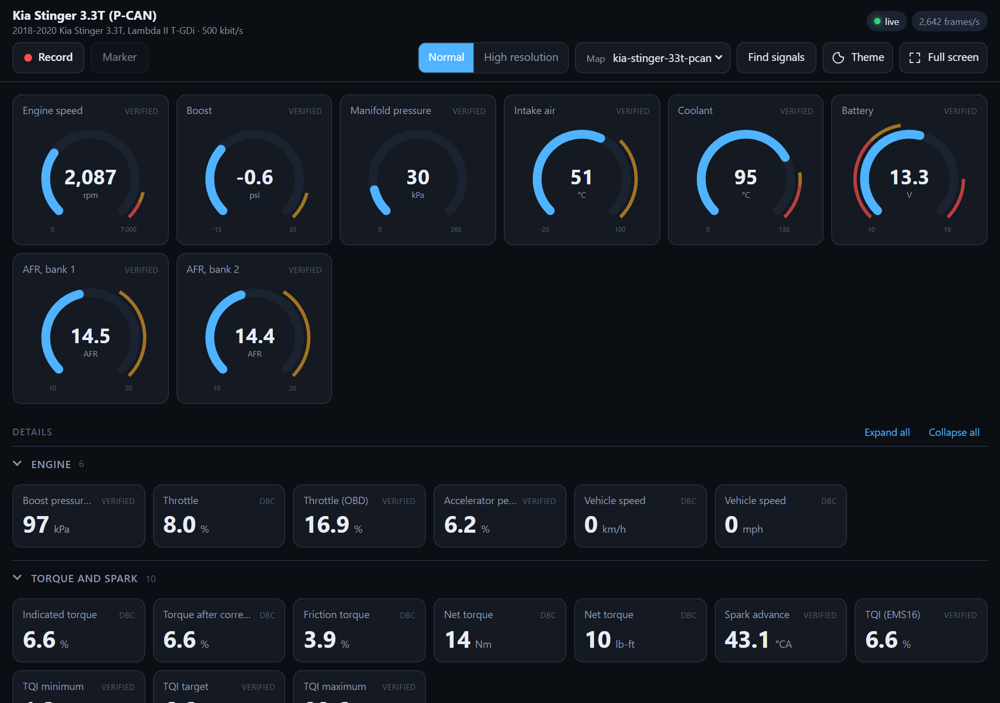
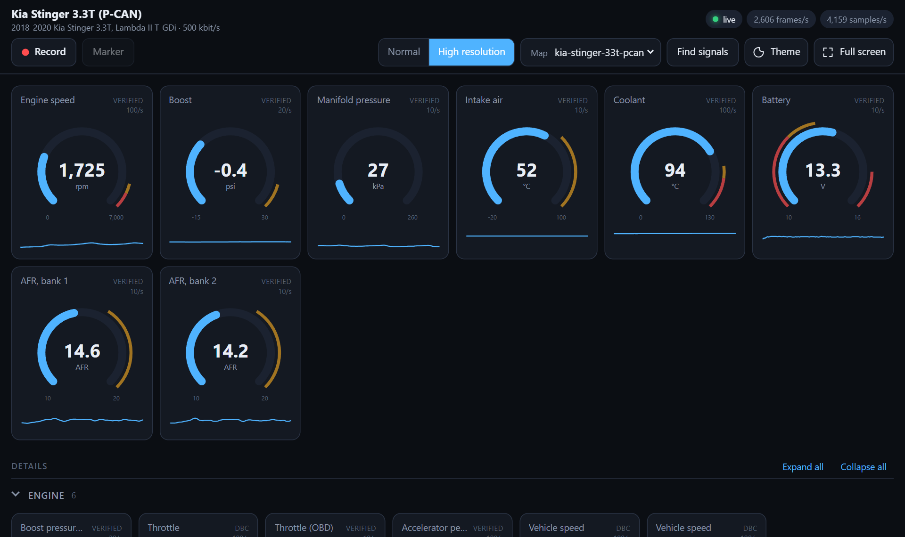
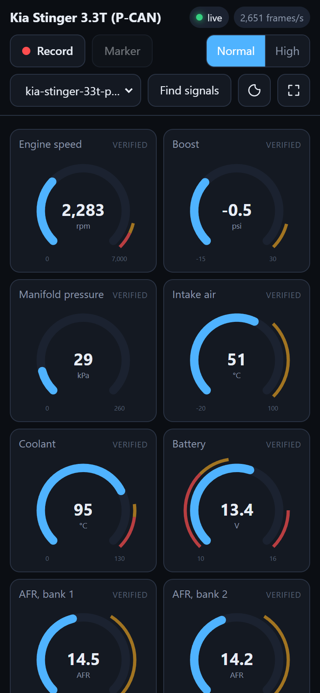
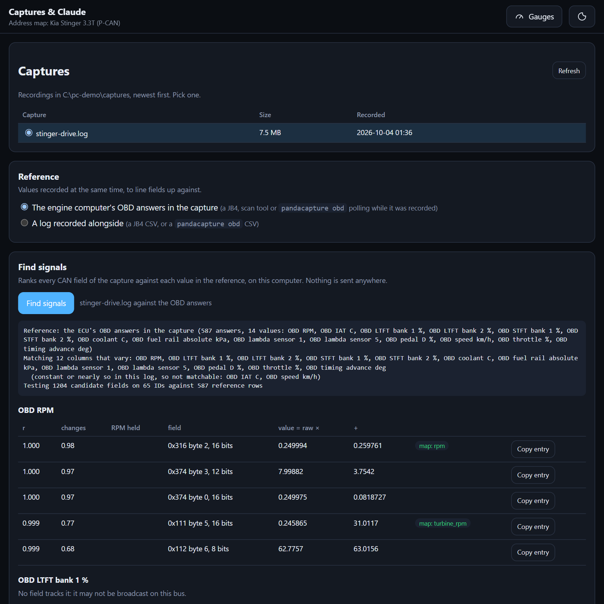
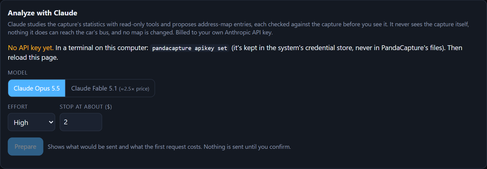

# PandaCapture for comma pandas

Records a car's CAN buses through a [comma](https://comma.ai) Red Panda or Black Panda, and shows
them live as gauges, numbers and status lights.



- **Captures** are candump logs, for finding which CAN fields carry the values a gauge, logger or
  controller needs (RPM, MAP/boost, intake temperature). PandaCapture's own signal finder, SavvyCAN
  and can-utils all read them.
- **The live dashboard** decodes the traffic in your browser with an address map for your vehicle.
  A Kia Stinger 3.3T map is built in.
- **The panda's firmware:** PandaCapture flashes its own onto the panda, backing up what was there
  first.
- **Transmitting:** it can send frames once you acknowledge a warning.

- **Listen-only by default.** The panda's CAN controllers sit in bus-monitoring mode: no ACKs, no
  error frames, nothing transmitted. The bus can't tell the panda is there.
- **Bit rates are found automatically**, by listening at each rate. A wrong rate can't disturb
  the bus while the panda is silent.
- **All three buses at once.** The log names them `can0`, `can1` and `can2`, and the status line
  shows which ones carry traffic. The Red Panda also receives CAN FD; the Black Panda is classic
  CAN only.
- **Windows and Linux** now; macOS is planned. On Android, see PandaCapture Android. The USB
  protocol is in [docs/protocol.md](docs/protocol.md).
- **Transmitting is gated.** You type `TRANSMIT` after a warning. Only PandaCapture's firmware can
  transmit at all, and it stops by itself within about 2 seconds if this program goes away.
- **Other adapters too (Windows):** RP1210 and J2534 tools such as a NEXIQ USB-Link 2, a Tactrix
  OpenPort or a Mongoose can record and drive the dashboard instead of a panda. See
  [Other adapters](#other-adapters-rp1210-and-j2534).
- **One file, nothing to install.** The program carries the firmware for both panda families, the
  dashboard and the built-in maps.

> **Status:** tested on a oneclone mini blackpanda (STM32F4):
> - flash backup, flashing and updating, and the transmit gate
> - capture from a Kia Stinger's P-CAN: about 2,430 frames/s for 165 s, with no dropouts
> - the dashboard: replaying real Stinger captures at full rate, with all 88 map signals decoding
>
> Not yet tested: a Red Panda, transmitting on a real bus, and the dashboard live in the car.
> See [STATUS.md](STATUS.md).

## Hardware

| Panda | Capture | PandaCapture firmware, transmit |
|---|---|---|
| Red Panda (STM32H7) | yes | yes |
| Black Panda (STM32F4) | yes | yes: built from comma's last panda firmware with every F4 board |
| Grey Panda (STM32F4), and boards that detect as one, such as oneclone's mini blackpanda | yes (tested on a oneclone board) | yes, same F4 build (flashed and gate-tested on a oneclone board) |
| White Panda (STM32F4) | yes | the F4 build supports it; untried, needs `flash --force` |
| Panda inside a comma three / 3X | not supported | refused |

### Other adapters (RP1210 and J2534)

On Windows, PandaCapture also records through the vendor driver of an RP1210 adapter (NEXIQ
USB-Link 2, Noregon DLA+, DG DPA and other truck tools) or a J2534 pass-thru (Tactrix OpenPort,
Drew Tech Mongoose, VCX Nano and most dealer and tuning tools). Install the adapter's driver, then:

```bash
pandacapture list
```

It lists every installed driver with CAN, whether or not the adapter is plugged in:

```
  --adapter "rp1210:NULN2R32:1"
      NEXIQ Technologies USB-Link 2: USB-Link 2,USB
```

```bash
pandacapture --adapter "USB-Link 2,USB"
```

```bash
pandacapture dashboard --map kia-stinger-33t-pcan --adapter "USB-Link 2,USB"
```

`--adapter` takes the name in quotes, or any part of it that matches only one adapter. Recording,
markers, rolling files, reconnecting and the dashboard all work as with a panda. The differences:

- **Not listen-only:** these adapters acknowledge frames like any CAN node. That's harmless on a car
  at the bus's real bit rate. Nothing is ever transmitted.
- **One bus**, recorded as `can0`.
- **Bit rate:** an RP1210 adapter can find it (`Baud=Auto`, the default). A J2534 one can't try rates
  on a live bus, so it needs `--bitrate 500` (the dashboard uses the map's bit rate).
- **32-bit drivers** work too. Most vendors ship only 32-bit ones, so PandaCapture loads the driver in
  a small helper program of the driver's bitness (`pandacapture-adapter-x86.exe` or `-x64.exe`,
  carried inside the program).
- **A driver that can't be used as installed:** `pandacapture list` says why. NEXIQ's J2534
  registration for the USB connection, for example, names no DLL. Use its RP1210 entry instead,
  or name the DLL: `--adapter j2534:C:\Windows\SysWOW64\NULU2J32.DLL`.
- **Close the vendor's own software first:** an adapter takes one program at a time.

## 1. Install

Download the program for your system from the [latest release](../../releases/latest):
- **Windows:** `pandacapture-windows-x64.zip` holds `pandacapture.exe` and double-click launchers
  (below). `pandacapture-windows-x64.exe` is the program alone.
- **Linux:** `pandacapture-linux-x64`.

It's one file: put it anywhere, for example on the laptop that goes in the car. Each release lists
SHA-256 sums. Or run from source:

```bash
pip install -e .
```

- **Windows:**
  - The panda installs its own WinUSB driver when plugged in.
  - The first flash needs one more driver, for the STM32 bootloader; see "Windows driver" below.
  - A panda with a USB-A socket needs a USB A-to-A cable. A USB-C-to-A cable won't connect it to a
    USB-C port.
- **Linux:** install the udev rules in [linux/](linux/README.md), or only root can open the panda.

### Double-click launchers (Windows)

For the car, where typing in a terminal is awkward, the zip has launchers to keep next to
`pandacapture.exe`:

| Launcher | Starts |
|---|---|
| `PandaCapture Dashboard.cmd` | the dashboard with the Stinger map, in high resolution, in a borderless window, recording the drive |
| `PandaCapture Record.cmd` | recording only. `M` = marker, `Q` = stop and save |
| `PandaCapture Check.cmd` | shows whether the panda is connected and powered |

- **Desktop or taskbar shortcut:** right-click a launcher, then **Send to → Desktop (create
  shortcut)**.
- **Change what a launcher starts:** right-click it, then **Edit**. The options are explained at the
  top of the file. They're also in [launchers/windows](launchers/windows).

Check it sees the panda:

```bash
pandacapture list
```

```bash
pandacapture info
```

## 2. Flash the PandaCapture firmware (once)

Capturing works on comma's firmware too. Flashing PandaCapture's firmware pins the panda to the
version this program was tested against, and is needed for transmitting.

```bash
pandacapture flash
```

Or open **Firmware** on the dashboard.
- **What it shows:** each panda connected, what it runs, and whether that's this program's
  firmware, an update, or a first install. A dot on the Firmware button flags a panda that needs
  one.
- **Flash:** the page lays out the steps for that panda, and you type `FLASH` to go ahead.
- **Back up only:** saves the whole flash without writing anything.
- **Restore:** puts a backup back after you type `RESTORE`.
- **While it runs:** the gauges let go of the panda and pick it up again afterwards. It works only
  on the computer running PandaCapture, and not while a recording is running.

- **The first time**, comma's bootstub only starts comma-signed firmware. PandaCapture puts the
  panda into the STM32's ROM bootloader (DFU), writes its own bootstub, then the firmware.
- **Later updates** only rewrite the firmware.
- **A backup comes first:** before replacing the bootstub, `flash` reads the panda's whole flash
  (bootstub, firmware, settings) back through the STM32 bootloader and saves it in a `backups`
  folder next to the program. If the chip won't read back, nothing is erased.
- **Back to what it ran before:** `pandacapture restore backups/panda-….bin` writes a backup back,
  which also covers firmware PandaCapture can't rebuild, such as a clone maker's or a fork's.
  `pandacapture backup` makes a backup on its own, without writing anything to the panda.
- **Back to openpilot:** a comma device flashes its own firmware onto a panda it's connected to.
  PandaCapture's bootstub starts comma-signed firmware too.

### Windows driver (first flash only)

The STM32 bootloader (USB `0483:DF11`) doesn't install a driver by itself. If `flash` stops with
"Windows has no WinUSB driver for it":

1. Leave the panda plugged in. It's waiting in the bootloader.
2. Open [Zadig](https://zadig.akeo.ie), choose **Options → List All Devices**, then pick
   **STM32 BOOTLOADER**.
3. Pick **WinUSB** as the driver and click **Install Driver**.
4. Run `pandacapture flash` again. It carries on from the bootloader.

## 3. Connect to the bus

Record the bus your gauge, logger or controller reads (or will read). On many modern cars, the OBD-II port sits
behind a gateway and only carries diagnostic traffic, so tap the powertrain CAN wires directly.

**[docs/wiring.md](docs/wiring.md)** has the pinouts and three ways to connect:
- a DIY breakout tapping one bus
- the car's OBD-II port
- a comma car harness

With a comma car harness, the bus to record goes on the harness's 26-pin connector (Molex
501646-2600), which the harness box passes to the panda's OBD-C port:

| Signal | 26-pin | Bus |
|---|---|---|
| CAN-H / CAN-L, car side | 4 / 6 | bus 0 |
| CAN-H / CAN-L, radar | 8 / 10 (and 18 / 20) | bus 1 |
| CAN-H / CAN-L, camera side | 22 / 24 | bus 2 |
| +12 V | 12, 14 | |
| Ground | 1, 26 | |

The OBD-C port isn't USB: never connect it to a computer or a charger.

**On a bench** (the panda wired straight to an ECU or a programmer, no car), put a 120 Ω resistor
across CAN-H and CAN-L. A car terminates its own bus, and pandas have no termination they can switch
on. Without one, the bus can look live while no frames come through and errors pile up.

## 4. Record

```bash
pandacapture
```

It finds each bus's bit rate, then shows a status line every second: frame rate, message IDs,
markers, traffic per bus. On Hyundai, Kia and Genesis engines, `RPM(0x316)` appears in it.

| Key | Does |
|---|---|
| `M` | drop a numbered marker into the log |
| `1`–`9` | drop a marker with that number |
| `Q` / `Esc` / Ctrl+C | stop and save |

The log goes to a `captures` folder next to the program, as `capture-YYYYMMDD-HHMMSS.log`. A
summary of every bus and ID is added at the end.

- **Speed range:** just before the summary, the log notes the speed range it covers, e.g.
  `# speed range: 0.0-102.2 km/h`. The speed comes from the address map's signals (`--map`, default the
  built-in one): the slower axle's wheel speeds, so wheelspin doesn't count, else the ECU's vehicle
  speed. PandaCapture Android writes the same line, so each reads the other's logs.

- **Long drives roll over:** a new file starts every 100 MB, about 15 minutes of a busy bus. Each
  part repeats the header and names the file before and after it, and markers keep counting.
  `--split-mb N` changes the size, and `--split-mb 0` keeps one file.

- **Stalls** are marked: `# stall: no frames since (time)` after 2 s without frames.
- **Panda errors** are marked: `# adapter error: …`. PandaCapture then reconnects and keeps recording
  into the same file: it retries every 2 s for up to 60 s.
- **Frames the panda dropped** are marked, when its receive buffer overflowed.

### What to record

Drop a marker before each step:

1. **Key on, engine off** (`1`), about 10 s.
2. **Idle** (`2`), about 10 s.
3. **A few throttle blips** (`3`).
4. **Optional: a pull into boost** (`4`), with a reference log running, such as a tuner's
   datalog, `pandacapture obd` or an ECU log.

Then find the signals in it with `pandacapture match` or the dashboard's Find signals
([6. Find unknown signals](#6-find-unknown-signals)).

### Bench (ECU on a bench cable)

With the panda as the only other node, nothing acknowledges the ECU's frames, so let the panda
acknowledge them. It still never transmits a frame:

```bash
pandacapture --ack --bitrate 500
```

## 5. Watch it live

```bash
pandacapture dashboard --map kia-stinger-33t-pcan
```

Your browser opens on gauges, numbers and status lights, decoded from the panda's traffic while it
listens silently. Press `Q` in the console to stop.

- **Gauges** come first, as the view to drive with.
- **Per-cylinder knock and the transmission,** whenever they're on the bus (another tester asking, or
  `pandacapture obd --knock --transmission`):
  - **Knock retard (E019):** a bar per cylinder (blue under 1.5°, amber to 3°, red beyond), with each
    cylinder's peak since the dashboard started or a replay began. Click it to reset the peaks.
  - **Transmission (01A0):** converter slip, turbine speed and ATF temperature gauges, with the output
    shaft speed, gear and ratio.
  - **Read knock / Read transmission** (off at first, remembered): the dashboard asks for them itself
    while it records. It sends the same requests, at the same rate and with the same rules as
    `pandacapture obd --knock --transmission` below. You type `TRANSMIT` once per session, on the
    computer running PandaCapture, and it needs a panda with PandaCapture firmware.

    Sending ends with the recording, and the panda goes back to listening. The capture keeps the
    requests and notes when sending started and stopped. The status shows each read's rate, or why it
    isn't sending.
- **US or metric:** the units button switches every page between US (mph, °F, psi, lb, ft, hp, lb-ft)
  and metric (km/h, °C, bar, kg, m, kW, Nm). Only what's shown changes: logs, run files and the map
  keep the car's own units, and a gauge's arc and zones stay where they were.
- **Every other group** (engine, fuel, cam phasers…) folds away. A folded group's badge still
  says when a lamp is lit or a value is in its warning zone.
- **A strip above the gauges** lists every lit warning lamp and every value in a warn or alert
  zone.
- **Pinned:** the star in any tile's corner puts a copy of it in a Pinned band at the top, under
  the warnings strip, in the order you pin them. The original stays where it was. Tap either star to
  unpin it. Each browser remembers its own pins for each map.

High resolution mode adds a 10-second trace and the update rate to each tile:



On a phone (with `--lan`), the controls fold into two rows:



An **address map** says which CAN IDs and bits mean what for your vehicle:
- **Built in:** `kia-stinger-33t-pcan`, 113 signals from comma's DBC, tracing of the ECU's CAN code, and captures of the car. It covers:
  - engine and boost; torque and spark
  - an idle and lope panel: idle target, 5 s RPM swing and low, alternator duty
  - cam phasers in degrees, with overlap, off-target (red) and tracking-lag (amber) lamps
  - temperatures, battery, fuel pressures, with a low-side fuel pressure lamp
  - drive mode and gear; wheel speeds and rear slip; the AWD coupling's duty and torque
  - brake pressure and pedal, accelerations, yaw rate and steering angle
  - traction control's torque requests, and engine and chassis lamps

  Each tile's description says whether its signal was checked on the car, came from a DBC, or was
  worked out from captures.
- **Your own:** a JSON file, as described in [docs/address-maps.md](docs/address-maps.md).
  - Signals can be decoded from frames or derived from other signals.
  - Enumerated values can show as text.
  - Put a map in a `maps` folder next to the program to use it by name.
- **List them:** `pandacapture maps`.

The bar at the top of the page:

| Control | Does |
|---|---|
| **Record / Stop** | records a capture while you watch, with the elapsed time. It rolls over to a new file every 100 MB, as above |
| **Marker** | drops a numbered marker into the recording. The `M` key does the same |
| **Map** | switches address map. Every open page reloads with it |
| **Captures** | opens the Captures & Claude page in its own window (below); the gauges keep running |
| **Normal / High resolution** | Normal updates each value 10 times a second. High resolution streams every sample as fast as the bus sends it, with a 10-second trace and the update rate on each tile |
| **Theme, Full screen** | light or dark, and the whole screen for the car |

The gauge page holds only what's needed while driving. Everything else is on the **Captures & Claude**
page:
- **Captures:** the captures folder, newest first, each tagged with the speed range it covers
  ("0–64 mph", "Stationary", or "No speed" when the map's speed signals never came up). Older logs
  without the line are read once in the background and remembered in `capture-speeds.json`.
- **Reference:** the OBD answers in the capture, or a logger's or `obd` log you add. Logs you add are kept
  until the dashboard stops.
- **Find signals:** runs [`match`](#6-find-unknown-signals) on this computer and lists the ranked fields;
  **Copy entry** copies a ready-made map entry.
- **Download bundle:** the capture packed with the analysis tools for another agent ([below](#hand-a-capture-to-another-agent)).
- **Analyze with Claude:** the same as [`analyze`](#let-claude-study-a-capture), with your API key. It
  shows what would be sent and what the first request costs, and nothing goes out until you press
  **Send**. Proposals come back checked against the capture, with **Copy entry** and **Download map
  entries**. If Claude built a map from them, **Use this map** adds it to your maps and switches the
  gauges to it; your old map stays in the map list.



Claude runs and bundle downloads only work from the computer running PandaCapture, not from devices
reaching the page through `--lan`.

The page only listens on this computer unless you start it with `--lan`. The controls reach as far
as the page does.

| Option | Does |
|---|---|
| `--record` | starts recording straight away (the Record button does the same) |
| `--replay LOG` | plays back a capture instead of reading the panda: try maps at your desk |
| `--simulate` | fake traffic |
| `--lan` | serves the page to other devices on your network, such as a phone on the dash. Only this computer can open it otherwise |

To look at a recorded drive at your desk, pick a capture under **Replay** on the gauges, or start with one:

```bash
pandacapture dashboard --map kia-stinger-33t-pcan --replay captures/capture-20261003-080200.log
```

While a replay runs, a timeline stays at the top of the gauges: play or pause, where it is and how long
the log is, a slider to scrub to any moment, and stop to go back to the panda.
- **Scrubbing** lands showing that moment: the 2 s before it are read at once, even while paused.
- **Pausing holds the gauges** bright: they go by the replay's clock, which stops while paused.
- **Only the replay shows** while it runs: the panda's frames are ignored on screen, though a recording
  started before keeps them.
- `--replay` and the picker also open a zip holding a capture: a shared capture with its OBD CSVs, or an
  exported bundle (its `capture.log`).

### Runs: timed and coached

**Runs** on the dashboard opens its own page. Pick a capture and **Find runs**: every full-throttle pull
and every hard stop in it is timed from the car's own wheel speeds, and coached.
- **Times:**
  - standing starts: 0-30, 0-60 mph, 60 ft to 1/4 mile, with 1 ft rollout and trap speeds;
  - rolling: 40-100 mph and the like;
  - stops: 60-0 mph.

  Each run measures the metric ones too (0-100 km/h, 100-200 km/h, 100-0 km/h). Which ones show follows
  the units: they're different runs, not one in two units. A run is known by 0-60 mph or 0-100 km/h.
- **The details:** each full-throttle shift (rpm, how long the torque was held, the old gear's g at its
  end against the new gear's once settled, and the rpm where they meet), and an estimated wheel-power
  curve per gear from your weight.
- **Where it could be better.** Each pointer comes with its own chart, shading the stretch it's about:
  - a late throttle or a low-boost launch;
  - wheelspin and traction-control cuts;
  - slow shifts, and shifts that came early or late against where the gears' pull meets;
  - slow boost build, knock;
  - low-side fuel pressure falling short, a lean bank, intake heat.
  The knock check leaves out the spark the car pulls on purpose: for a shift's torque hold, for traction
  control, and around gear changes.
- **Against your best.** Runs are kept in `captures/runs`. A new run is compared with your best of the
  same kind, with the speed range where it lost the most time and why. A capture read again updates
  its runs rather than comparing them with themselves.
- **Events:** brake stands, launches and pop windows (fuel still on during an overrun), over the whole
  capture.

There's no GPS here, so no road-grade correction or certification: the times are the car's own.
From a terminal: `pandacapture runs CAPTURE [--units metric]`.

### Developer Tools

**Developer Tools** on the dashboard opens a page for building extra tools onto PandaCapture without
touching the gauges. It lists ready-made hooks on `window.PCDev`, each running live with a snippet to
copy:
- **Live values:** every signal about 10 times a second, one signal, or every sample as it arrives.
- **The map and the API:** the address map (and when it's switched), and any endpoint as JSON. The page
  lists every endpoint.
- **UI:** a section in the app's style, and a sparkline.

A tool goes in the page's build area. The dashboard has no sign-in: with `--lan`, anyone on the network
can use these hooks too.

## 6. Find unknown signals

Record a capture while another tool logs the same drive, then let PandaCapture work out which CAN
fields carry which values:

```bash
pandacapture match captures/capture-20261003-035135.log logger.csv --map kia-stinger-33t-pcan
```

1. **Lines the logs up:** it fits the other log's clock to the capture's by RPM. Any CSV with a
   time column and an RPM column works; settings rows some loggers put first are skipped.
2. **Tests every field:** each 8-, 12- and 16-bit field of every broadcast ID, against each column
   that changes.
3. **Ranks the results:** each field gets a correlation and a fitted scale and offset, plus two
   checks against coincidences. **changes** catches two values that merely drift together.
   **RPM held** catches two that both just follow engine speed.

The dashboard's Captures & Claude page runs the same match on a capture it recorded (screenshot
[above](#5-watch-it-live)).

**The capture can calibrate itself:** if a logger or scan tool polls the ECU over OBD on the same bus,
its requests and the ECU's answers are in the capture. `--obd` uses those answers as the reference,
with no second log:

```bash
pandacapture match captures/capture-20261003-035135.log --obd
```

That's how the Stinger map's lambda, fuel trims, OBD throttle and fuel rail pressure were confirmed
against the ECU's own answers. A match is evidence, not proof: add it to a map as `observed` until
it's checked.

### Let Claude study a capture

```bash
pandacapture analyze captures/capture-20261003-035135.log
```

Claude reads the capture's statistics and proposes address-map entries. Each one is checked against the
capture before you see it. It uses **your own Anthropic API key**, billed to your account, and only
**Claude Opus 5.5** (default) or **Claude Fable 5.1** (`--model fable`, about 2.5x the price).

1. **Save your key once.** It goes into the system's credential store (Windows Credential Manager, macOS
   Keychain, Secret Service on Linux), never into PandaCapture's files:

   ```bash
   pandacapture apikey set
   ```

   Or set `ANTHROPIC_API_KEY`. PandaCapture uses an API key only, never any other login.
2. **The local part runs first.** It works out statistics for every broadcast id, and the reference
   values: the engine computer's OBD answers in the capture, or a log you give alongside it
   (`analyze CAPTURE logger.csv`).
3. **It asks before sending,** and says what goes out and what the first request costs:
   - statistics, not the capture itself
   - ids whose frames carry text (which can include the VIN) are withheld
   - diagnostic ids only appear as decoded reference values
4. **Claude works with read-only tools:** an id's byte statistics and sample frames, value series, and
   correlations against the reference. Nothing it does can reach the car's bus.
5. **Its proposals are checked locally** against the map's rules and the reference. Each says where it
   goes on the dashboard: its group, and number, gauge (with a range) or status light. The results are
   saved as `analysis-….json`, with `map_entries` ready to paste into a map, marked `observed`.
6. **It can build a new map:** your current map plus the proposals it picks, checked like any map and
   saved beside the results as `analysis-…-map.json`. No map is changed: try the new one with
   `pandacapture dashboard --map` and that file, or **Use this map** on the dashboard.

It stops at about $2 or 20 turns (`--max-cost`, `--max-turns`) and prints what it used. The dashboard's
Captures & Claude page does the same from the browser:


 A short capture
with the engine computer's OBD answers in it (a logger or `pandacapture obd` polling meanwhile) gives it
the most to work with.

### Hand a capture to another agent

```bash
pandacapture bundle captures/capture-20261003-035135.log logger.csv
```

Writes `capture-…-bundle.zip` for your own Claude account, Claude Code, or anyone else. It holds the
capture, the reference log, the address map, and PandaCapture's analysis tools: the same read-only tools
`analyze` gives Claude, as a small Python program that needs nothing else installed. Unzip it and point
the agent at the folder: its `README.md` says how to work, and Claude Code also reads its `CLAUDE.md`.

```bash
python tools.py
```

```bash
python tools.py search_references "reference=OBD RPM" top=5
```

The capture in the bundle is scrubbed:
- **no header lines,** which name the panda's serial number
- **no ids whose frames carry text,** which can include the VIN
- **of the diagnostic ids, only OBD mode 01 live-value exchanges and UDS reads of data by
  identifier** (22, e.g. a tuning tool's reads of E019). VIN reads (mode 09), fault codes,
  identification data (F1xx) and any identifier whose answers carry text are dropped.

Markers and events stay. The reference log goes in as you gave it, so check it before sharing.

## 7. Scan the OBD PIDs

The panda can ask the car's modules for standard OBD data itself, like a scan tool, with no other
hardware:

```bash
pandacapture obd
```

So can an ELM327 (USB, Bluetooth or WiFi) plugged into the OBD port, for anyone without a panda:

```bash
pandacapture obd --elm COM5
```

`pandacapture list` shows the serial ports. A Bluetooth ELM327 gets a COM port (Windows) or
`/dev/rfcomm0` (Linux) once paired; a WiFi one is `--elm socket://192.168.0.10:35000`. An ELM327
only works on CAN cars (every US car since 2008), and it can't record the bus: only the requests and
answers are saved.

1. **Listens first:** finds the bit rates and which buses have traffic, and reads the engine speed
   from the address map's RPM signal.
2. **Scans:** asks every module on each bus which standard (mode 01) PIDs it supports, and reads
   each one once.
3. **Sorts them:** a PID is kept on each bus where a module answered with a real value. PIDs that
   gave nothing real on any bus (no answer, `FF` "not available", an answer too long to read) are
   discarded, and the scan's report lists each one with the reason.
4. **Polls** the kept PIDs one after another until you press `Q` (or after `--seconds N`;
   `--scan-only` skips it).

The scan only needs doing once per car. Later, poll straight away, at any engine speed:

```bash
pandacapture obd --poll captures/obd-scan-20261004-101500.json
```

```bash
pandacapture obd --elm COM5 --pids 0C,0D,05,0B
```

It saves three files in the captures folder:
- **`obd-scan-….json`:** what each module supports, the values read, and the discarded PIDs with
  their reasons.
- **`capture-….log`:** everything received, OBD answers included, so `match --obd` works on it.
- **`obd-….csv`:** the decoded answers, with engine speed as `RPM`, ready to use as a Find signals
  reference.

### Per-cylinder knock and the transmission

Through a panda, it can also read two of the modules' own data identifiers, several times a second:

```bash
pandacapture obd --knock --transmission
```

- **`--knock`:** the engine's knock retard per cylinder (`22 E019` to `0x7E0`), with two raw
  per-cylinder figures that are probably a knock count and the knock sensors' noise.
- **`--transmission`:** the transmission's turbine and output shaft speeds, converter slip, ATF
  temperature and gear (`22 01A0` to `0x7E1`).

Alone they skip the PID scan; with `--pids` or `--poll` they share the bus with the PIDs.
- **One request at a time:** the reads go first when they're due, with the PIDs in between.
- **Rate:** five reads a second each, rising to ten while the answers come back quickly. They slow down
  when a module says it's busy or doesn't answer.
- **Stopping:** a read stops after any other refusal, or after 8 unanswered requests in a row.
- **Another tester:** while one asks a module, that module isn't asked until 2 s after its last request.
  Its answers are read instead, and the PIDs wait too.
- **Bus trouble:** a bus going bus-off, or counting over 50 errors in a second, ends all sending at
  once.

Every recording also saves these answers whenever they're heard, whoever asked, beside the capture:
- **`obd-knock-….csv`:** knock retard per cylinder in degrees, the two raw figures, and the spark
  advance at the time.
- **`obd-tcu-….csv`:** engine and turbine speed, slip, output shaft speed, ATF temperature, ratio and
  gear.

The capture's end notes name each file and how many readings it holds.

Rules it keeps to:
- **Read-only:** the only requests it sends are mode 01 "current data" (`02 01 PID`) to `0x7DF`,
  and with `--knock` or `--transmission` the two reads above, with the flow control for their long
  answers, one at a time. Nothing that clears codes, changes settings or writes.
- **The scan runs key-on or at idle only:** it's blocked above 900 rpm, and no option changes
  that. Engine speed is checked before and after every scan request, and any reading above 900 rpm
  between checks stops it. With no RPM signal in the map (or through an ELM327), it reads RPM over
  OBD (one request) before anything else. If engine speed isn't known, it doesn't scan.
- **The poll runs at any engine speed:** it only asks for PIDs already known to answer, as a scan
  tool or logger does. Set it up parked.
- **An acknowledgement:** you type `TRANSMIT` after a warning about what it sends. Through a panda
  it also needs PandaCapture firmware.
- **Pause other OBD loggers** (a tuner's datalogger, a scan tool) while it runs: they'd get the same answers.

## 8. Read the codes

```bash
pandacapture codes
```

```bash
pandacapture codes --elm COM5
```

From every OBD module, it reads:
- the check-engine light, and how many codes it counts
- **stored, pending and permanent** codes. Each is marked **generic** (its meaning is the same on every
  car) or **manufacturer** (look it up for the make).
- the **freeze frame**: the code that stored it, and the engine's values at that moment
- **vehicle information:** calibration IDs and numbers, and the module's name. The VIN only with
  `--vin`, since it identifies the car.

Nothing is cleared or changed. It's read-only like `obd`: you type `TRANSMIT` after a warning, and
it runs at any engine speed. The results are saved as `codes-….json` in the captures folder.

### Clearing codes

```bash
pandacapture codes --clear
```

Reads and shows the codes first, then explains what clearing does:
- it erases the codes and the freeze frame
- it sets the emissions readiness monitors back to "not ready": an inspection fails until they've run
  again, over several drive cycles
- it may reset learned values (fuel trims, idle), so the engine can run oddly until it relearns
- a fault that's still there sets its code again
- permanent codes clear themselves later, not by this

It clears only when you type `CLEAR`, and only with:
- **the engine off** (key on): 0 rpm through the whole interval since the last check;
- **the car stopped:** 0 km/h, which also covers a hybrid on its motor and stop-start at a light;
- **Park,** when the map knows the gear.

Engine speed and vehicle speed are read anew right before each clear request. That's the next
broadcast, or an OBD answer when nothing broadcasts them (as through an ELM327). If the engine starts
or the car moves, clearing stops. Afterwards it reads the codes again. `--uds` also clears each module's
own codes (UDS `14`). The vehicle's state at each clear is in the transmit log.

### Engine-off diagnostics

```bash
pandacapture diag --module 7E0
```

An interactive session with a module, for what a dealer tool does with the engine off. Type `help` in it
for the full list:
- `session extended` and `session default`
- `dtc-setting off` and `on`
- `comm disable` and `enable`
- `reset hard`, `keyoff` or `soft`
- actuator tests: `io DID adjust HEX`, then `io DID return`
- routines: `routine start`, `stop` or `result RID`
- `read DID`, `status`, `end`

The first command that changes something shows a warning and needs `ENGINE OFF` typed. Then:
- **Checked all session long:** engine off (key on), the car stopped, and Park where the map knows the
  gear. Checked before each request, and several times a second for the whole session.
- **Undone at once:** if the engine starts, the car moves or a reading goes missing, everything active is
  undone, newest first: actuators handed back, routines stopped, code setting and communication back
  on. Then the modules return to their default session.
- **Tester present only while that holds.** It's what keeps a module in its extended session. If
  PandaCapture stops, the modules drop back to their default session by themselves within about 5 s.
- **Never sent:** programming sessions, flashing and security access. Writing settings (`2E`) isn't
  available yet.

Actuator tests and routines can move parts (fans, pumps, the throttle, injectors): keep hands and tools
clear, and know what each one does before starting it.

### Each module's own codes and data (UDS)

Beyond the standard OBD set, each module keeps its own codes and data, which dealer tools read with
UDS. These are reads too:

```bash
pandacapture modules --find
```

Finds every module that answers. It asks each id from 700 to 7F7 for its part number (about 240
requests), then lists each module found with its system name, part, hardware and software numbers.
Without `--find`, only the OBD modules are listed.

```bash
pandacapture codes --uds --module 7D1
```

Adds each module's own codes, with their status: confirmed, pending, failing now, warning light.
It reads the OBD modules plus any module you name with `--module`.

```bash
pandacapture did --module 7E0 E001 E002 --every 0.5
```

Reads data identifiers from one module, such as the `22 E0xx` reads some tuning tools make, once or repeatedly
until `Q`. Results go to `did-….json`, and the answers are in the capture too.

Modules are addressed by request id (700-7F7), answering on id + 8, the usual convention. PandaCapture
never sends to an id the bus is already using for ordinary traffic, nor to one whose answers would land on
such an id.

**On the dashboard,** **Modules** does the same through the panda the gauges are reading, so the gauges keep
running and a recording keeps every frame.
- **Scan modules:** finds every module (the OBD ones, then each id from 700 to 7F7, key-on or at idle
  only), then reads what each one is and its own codes.
- **Read identifiers:** reads data identifiers from one module, at any engine speed. Click a module in the
  scan results to fill it in.
- **Gates:** you type `TRANSMIT` once per session, on the computer running PandaCapture, and it needs a
  panda with PandaCapture firmware.
- **Files:** each run saves `obd-modules-….json` or `obd-did-….json`, and a `.log` of every diagnostic
  frame exchanged, in the captures folder. The page shows the last scan again when it opens.

## Transmitting

```bash
pandacapture send 7DF#02010C --bus 0 --count 5 --interval-ms 200
```

```bash
pandacapture replay captures/capture-20261002-120000.log --bus-map 0:1 --ids 316,329
```

Both commands show what is about to be sent and a warning, and wait for you to type `TRANSMIT`.
For scripts, `--i-accept-transmit-risk` skips the typing; the warning is still printed. Then:

- **Firmware check:** the panda must run PandaCapture firmware. Its transmit gate refuses every
  other way of transmitting, including openpilot's car modes.
- **Arming:** on pandas with status LEDs, the green LED is on while transmit is armed. Some boards,
  such as oneclone's mini blackpanda, have none; `pandacapture info` shows the mode either way.
- **Heartbeat:** PandaCapture sends one several times a second. Without it, the panda drops back to
  listen-only within about 2 seconds.
- **Log:** every frame sent goes to a `tx-….log` in the captures folder.

Only transmit on a bench, or with the vehicle parked and secured.

## Options

```
pandacapture [options]          record
  --bitrate RATE                auto (default), kbit/s for all buses (500), or per bus (0=500)
  --bus N                       record only bus N (repeatable)
  --data-bitrate KBPS           CAN FD data rate (default 2000)
  --ack                         acknowledge frames (bench); needs --bitrate
  --obd                         record CAN3 (the multiplexed OBD bus) as bus 1
  --out DIR                     where to save captures
  --seconds N                   stop after N seconds
  --split-mb N                  new file every N MB (default 100; 0 = one file)
  --map NAME|FILE               address map for the log's speed range (default: the built-in one)
  --no-reconnect                stop on a panda error
  --reconnect-seconds N         how long to keep trying (default 60)
  --serial S                    which panda (see: pandacapture list)
  --adapter NAME                an RP1210 or J2534 adapter instead (see: pandacapture list)
  --simulate                    fake traffic, no panda needed
  --simulate-dropout N          fake traffic that drops out after N seconds

pandacapture dashboard [options]      live gauges in the browser
  --map NAME|FILE               address map (see: pandacapture maps)
  --replay LOG [--speed X] [--no-loop]   play back a capture instead of the panda, with a timeline
  --simulate                    fake traffic
  --adapter NAME                an RP1210 or J2534 adapter instead of the panda
  --record [--out DIR]          start recording straight away
  --split-mb N                  new recording file every N MB (default 100; 0 = one file)
  --bitrate RATE                default: the map's bit rate
  --port N                      web server port (default 8765)
  --lan                         serve to other devices on the network too
  --no-browser                  don't open the browser
  --mode normal|high            the page's starting update rate
  --app                         a borderless app window (Edge or Chrome) instead of a browser tab

pandacapture obd [options]      scan the standard OBD PIDs (key-on or idle), then poll the ones that answer
  --elm PORT                    through an ELM327: COM5, /dev/rfcomm0, socket://192.168.0.10:35000
  --poll SCAN.json | --pids LIST   skip the scan: poll an earlier scan's PIDs, or these (0C,0D)
  --bus N                       panda bus to use (repeatable; default: every bus with traffic)
  --map NAME|FILE, --rpm-key K  where the engine's broadcast RPM comes from (default: the built-in map's rpm)
  --scan-only                   don't poll
  --knock, --transmission       also read per-cylinder knock (22 E019) and the transmission (22 01A0); alone, only those
  --seconds N                   stop polling after N seconds

pandacapture codes [options]    read stored, pending and permanent codes, freeze frame, vehicle info
  --elm PORT                    through an ELM327 instead of the panda
  --uds [--module ID]           also each module's own codes
  --vin                         also read the VIN
  --clear                       then clear them: engine off, car stopped, CLEAR typed

pandacapture modules [--find] [--module ID]     the modules that answer, and what they are
pandacapture diag --module ID                   an engine-off diagnostic session (type help in it)
pandacapture did --module ID DID... [--every S]  read data identifiers from one module

pandacapture analyze CAPTURE [REFERENCE.csv] [options]     Claude proposes map entries (your API key)
  --model opus|fable            Claude Opus 5.5 (default) or Claude Fable 5.1
  --max-cost D, --max-turns N   stop at about D dollars (default 2) or N turns (default 20)
pandacapture apikey set | clear | status     your Anthropic API key, in the system's credential store
pandacapture bundle CAPTURE [REFERENCE.csv]  a scrubbed capture with the analysis tools, for another agent
pandacapture runs CAPTURE [--weight-lb LB] [--units us|metric]   time the runs in a capture, and where they could be better

pandacapture match CAPTURE [REFERENCE.csv | --obd] [options]     find which fields carry which values
  --map NAME|FILE               map with the RPM signal used to line the logs up
  --ref-rpm COLUMN              the reference's RPM column (default RPM)
  --column NAME                 match only this column (repeatable)
  --top N, --min-r R            how many matches to show, and the weakest to show

pandacapture list | info | dashboard | maps | match | analyze | apikey | bundle | obd | codes | modules | did | flash | backup | restore | send | replay | selftest      (each has --help)
```

## Documentation

| | |
|---|---|
| [docs/wiring.md](docs/wiring.md) | The panda's OBD-C pinout, the comma harness's 26-pin, OBD-II, breakouts, termination |
| [docs/address-maps.md](docs/address-maps.md) | Writing an address map for the dashboard |
| [docs/protocol.md](docs/protocol.md) | The panda's USB protocol as PandaCapture uses it, for porting (e.g. to Android) |
| [docs/diagnostics-plan.md](docs/diagnostics-plan.md) | Plan: reading and clearing codes, and full diagnostics with the engine off |
| [STATUS.md](STATUS.md) | What's been tested on real hardware, and what hasn't |

## Privacy

A capture holds everything the car broadcasts. Check it before sharing: some cars broadcast the
VIN or odometer.

## Building

```bash
git clone --recurse-submodules https://github.com/suburbazine/pandacapture
```

- **Tests:** `pip install -e ".[dev]"`, then `python -m pytest`.
- **Firmware:** `python firmware/build.py` builds both targets: `h7` (Red Panda) and `f4` (Black,
  Grey and White Panda). See the top of [firmware/build.py](firmware/build.py) for the Arm toolchain and
  pycryptodome. It builds on Windows, Linux or in Docker (`--docker`).
- **One-file program:** `pip install ".[package]"`, then `python packaging/build_exe.py`.
- **CI:** [GitHub Actions](.github/workflows/build.yml) builds the firmware and the Windows and
  Linux programs on every push, and publishes a release for every `v*` tag.

The firmware is comma's panda firmware at pinned commits, plus the patches in
[firmware/patches](firmware/patches), signed with the panda project's public development key:
- **Red Panda:** a recent commit.
- **Black, Grey and White Panda:** comma's last commit before it started removing F4 boards
  (`e462c34d`, June 2025), with the opendbc commit it pinned. comma no longer maintains that firmware.

PandaCapture isn't made or endorsed by comma.ai. See [THIRD_PARTY_NOTICES.md](THIRD_PARTY_NOTICES.md).

## License

Copyright (C) 2026 Xtremission LLC.

PandaCapture is free software: you can redistribute it and/or modify it under the terms of the GNU
General Public License as published by the Free Software Foundation, either version 3 of the License,
or (at your option) any later version. It is distributed in the hope that it will be useful, but
WITHOUT ANY WARRANTY; without even the implied warranty of MERCHANTABILITY or FITNESS FOR A PARTICULAR
PURPOSE. See [LICENSE](LICENSE) for the full terms.

Releases up to and including 0.9.0 were published under the MIT License, and those copies keep it.
The parts PandaCapture builds on keep their own licenses: see
[THIRD_PARTY_NOTICES.md](THIRD_PARTY_NOTICES.md).
